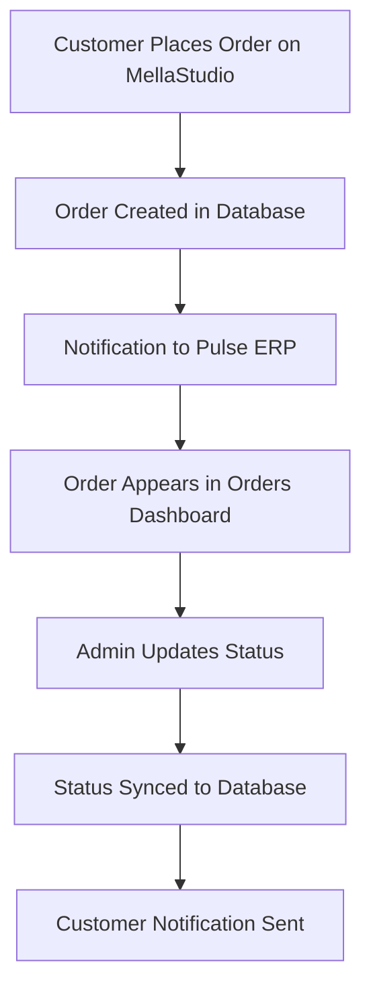
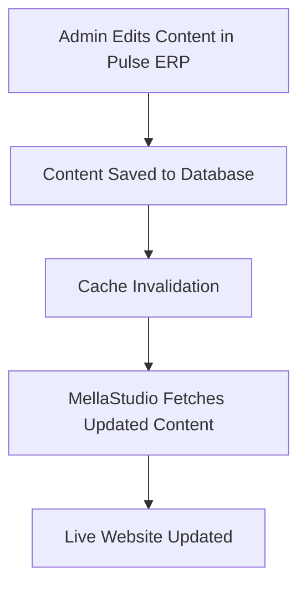
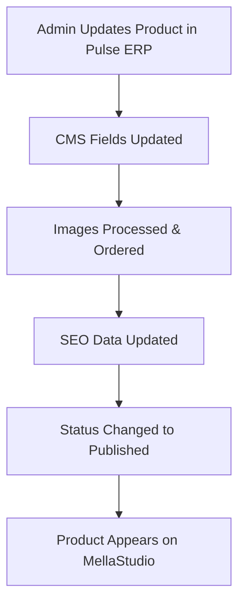

# Pulse ERP - Ecommerce & CMS Management Implementation Guide

## 🎯 Project Overview

This guide outlines the implementation of **Ecommerce & CMS Management** functionality in Pulse ERP to support the **MellaStudio** frontend. Both systems share the same database, AppSync GraphQL API, resolvers, and Lambda functions.

### System Architecture

```
MellaStudio (Customer Frontend) ←→ Shared AppSync/Lambda ←→ Pulse ERP (Admin Interface) ←→ Shared PostgreSQL Database
```

### Integration Points

-   **Shared Database**: Same PostgreSQL instance with multi-tenant architecture
-   **Shared GraphQL**: Same AppSync API with unified schema
-   **Shared Auth**: HMAC-based authentication system
-   **Order Flow**: Orders placed on MellaStudio → managed in Pulse ERP
-   **Content Flow**: Content created in Pulse ERP → displayed on MellaStudio

---

## 🗄️ Database Schema (Already Exists)

### Core Tables Overview

#### 1. CMS Content Tables

```sql
-- Navbar Configuration
cms_navbar_config (
    id UUID PRIMARY KEY,
    tenant_id VARCHAR(50) UNIQUE,
    logo_config JSONB,
    center_navigation JSONB,
    right_navigation JSONB,
    search_config JSONB,
    cart_config JSONB,
    styling JSONB,
    created_at TIMESTAMP,
    updated_at TIMESTAMP
);

-- Hero Sections
cms_hero_sections (
    id UUID PRIMARY KEY,
    tenant_id VARCHAR(50),
    badge TEXT,
    headline TEXT,
    subtitle TEXT,
    first_word_style JSONB,
    last_word_style JSONB,
    cta JSONB,
    background_media JSONB,
    is_active BOOLEAN,
    order_index INTEGER,
    created_at TIMESTAMP,
    updated_at TIMESTAMP
);
```

#### 2. Enhanced Products Table

```sql
-- Products with CMS Fields
products (
    id UUID PRIMARY KEY,
    tenant_id UUID,
    name TEXT,
    description TEXT,
    slug VARCHAR(255),              -- ✅ CMS: URL-friendly identifier
    short_description TEXT,         -- ✅ CMS: Brief product summary
    product_price DECIMAL,
    product_cost DECIMAL,
    featured BOOLEAN DEFAULT false, -- ✅ CMS: Homepage showcase
    status VARCHAR(20) DEFAULT 'draft', -- ✅ CMS: draft/published/archived
    display_order INTEGER DEFAULT 0,    -- ✅ CMS: Sort order
    seo_title VARCHAR(255),         -- ✅ CMS: SEO optimization
    seo_description TEXT,           -- ✅ CMS: Meta description
    seo_keywords TEXT,              -- ✅ CMS: Search keywords
    published_at TIMESTAMP,         -- ✅ CMS: Publication date
    cms_metadata JSONB DEFAULT '{}', -- ✅ CMS: Additional data
    category_id UUID,
    brand UUID,
    created_at TIMESTAMP,
    updated_at TIMESTAMP
);

-- Product Files with Enhanced Structure
product_files (
    id UUID PRIMARY KEY,
    product_id UUID,
    file_id UUID,
    tenant_id UUID,
    file_key TEXT,
    file_name TEXT,
    file_type TEXT,
    file_url TEXT,                  -- ✅ Generated S3 URLs
    order_index INTEGER DEFAULT 0,  -- ✅ Image ordering
    image_type VARCHAR(50) DEFAULT 'gallery', -- ✅ primary/hover/gallery
    is_deleted BOOLEAN DEFAULT false,
    created_at TIMESTAMP,
    updated_at TIMESTAMP
);

-- Files Storage
files (
    id UUID PRIMARY KEY,
    key TEXT,                       -- ✅ S3 object key
    file_name TEXT,
    file_type TEXT,
    tenant_id UUID,
    deleted_at TIMESTAMP,
    created_at TIMESTAMP
);
```

#### 3. Ecommerce Tables (Need Implementation)

```sql
-- Orders (NEW - Needs Implementation)
CREATE TABLE orders (
    id UUID PRIMARY KEY DEFAULT uuid_generate_v4(),
    tenant_id UUID NOT NULL REFERENCES tenants(id),
    customer_id UUID REFERENCES customers(id),
    order_number VARCHAR(50) UNIQUE,
    status VARCHAR(20) DEFAULT 'pending', -- pending/processing/shipped/delivered/cancelled
    total_amount DECIMAL(10,2),
    subtotal DECIMAL(10,2),
    tax_amount DECIMAL(10,2),
    shipping_amount DECIMAL(10,2),
    currency VARCHAR(3) DEFAULT 'ETB',
    payment_status VARCHAR(20) DEFAULT 'pending',
    payment_method VARCHAR(50),
    shipping_address JSONB,
    billing_address JSONB,
    notes TEXT,
    created_at TIMESTAMP DEFAULT CURRENT_TIMESTAMP,
    updated_at TIMESTAMP DEFAULT CURRENT_TIMESTAMP
);

-- Order Items (NEW - Needs Implementation)
CREATE TABLE order_items (
    id UUID PRIMARY KEY DEFAULT uuid_generate_v4(),
    order_id UUID REFERENCES orders(id),
    product_id UUID REFERENCES products(id),
    variant_id UUID,
    quantity INTEGER,
    unit_price DECIMAL(10,2),
    total_price DECIMAL(10,2),
    product_name TEXT,
    product_variant TEXT,
    created_at TIMESTAMP DEFAULT CURRENT_TIMESTAMP
);

-- Customers (NEW - Needs Implementation)
CREATE TABLE customers (
    id UUID PRIMARY KEY DEFAULT uuid_generate_v4(),
    tenant_id UUID NOT NULL,
    email VARCHAR(255) UNIQUE,
    first_name VARCHAR(100),
    last_name VARCHAR(100),
    phone VARCHAR(20),
    default_address JSONB,
    created_at TIMESTAMP DEFAULT CURRENT_TIMESTAMP,
    updated_at TIMESTAMP DEFAULT CURRENT_TIMESTAMP
);
```

---

## 🔌 Available GraphQL Operations

### Current CMS Operations (Already Implemented)

```graphql
# Content Management
getNavbarConfig(tenantId: String!): NavbarConfig
getHeroSections(tenantId: String!): [HeroSection!]!
getFeaturedProducts(tenantId: String!, limit: Int): [Product!]!
getProductsByCategory(tenantId: String!, category: String!, limit: Int): [Product!]!
```

### Required New Operations (Need Implementation)

```graphql
# CMS Management
updateNavbarConfig(tenantId: String!, config: NavbarConfigInput!): NavbarConfig
createHeroSection(tenantId: String!, section: HeroSectionInput!): HeroSection
updateHeroSection(id: ID!, section: HeroSectionInput!): HeroSection
deleteHeroSection(id: ID!): Boolean

# Product Management
updateProduct(id: ID!, product: ProductInput!): Product
updateProductCMSFields(id: ID!, cms: ProductCMSInput!): Product
reorderProducts(tenantId: String!, productIds: [ID!]!): Boolean

# Ecommerce Management
getOrders(tenantId: String!, filters: OrderFilters): [Order!]!
getOrder(id: ID!): Order
updateOrderStatus(id: ID!, status: String!): Order
getCustomers(tenantId: String!, filters: CustomerFilters): [Customer!]!
```

---

## 🏗️ Required UI Components

### 1. Sidebar Menu Structure

```typescript
// Recommended Sidebar Menu Addition
const ecommerceCMSMenuItems = [
    {
        section: 'Ecommerce',
        icon: '🛒',
        items: [
            {
                label: 'Orders',
                icon: '📦',
                path: '/ecommerce/orders',
                permissions: ['ecommerce.orders.read'],
            },
            {
                label: 'Customers',
                icon: '👥',
                path: '/ecommerce/customers',
                permissions: ['ecommerce.customers.read'],
            },
            {
                label: 'Analytics',
                icon: '📊',
                path: '/ecommerce/analytics',
                permissions: ['ecommerce.analytics.read'],
            },
        ],
    },
    {
        section: 'Content Management',
        icon: '🎨',
        items: [
            {
                label: 'Website Settings',
                icon: '⚙️',
                path: '/cms/settings',
                permissions: ['cms.settings.manage'],
            },
            {
                label: 'Navigation',
                icon: '🧭',
                path: '/cms/navigation',
                permissions: ['cms.navigation.manage'],
            },
            {
                label: 'Hero Sections',
                icon: '🎯',
                path: '/cms/hero-sections',
                permissions: ['cms.hero.manage'],
            },
            {
                label: 'Featured Products',
                icon: '⭐',
                path: '/cms/featured-products',
                permissions: ['cms.products.manage'],
            },
            {
                label: 'SEO Settings',
                icon: '🔍',
                path: '/cms/seo',
                permissions: ['cms.seo.manage'],
            },
        ],
    },
]
```

### 2. Page Components Required

#### A. Orders Management (`/ecommerce/orders`)

```typescript
interface OrdersPageFeatures {
    // List View
    ordersTable: {
        columns: ['Order #', 'Customer', 'Date', 'Status', 'Total', 'Actions']
        filters: ['Status', 'Date Range', 'Customer', 'Payment Status']
        actions: ['View Details', 'Update Status', 'Print Invoice']
        pagination: boolean
        search: boolean
    }

    // Detail View
    orderDetails: {
        sections: ['Customer Info', 'Items', 'Payment', 'Shipping', 'Timeline']
        editableFields: ['Status', 'Notes', 'Tracking Number']
        actions: ['Print Invoice', 'Send Email', 'Process Refund']
    }

    // Status Management
    statusWorkflow: {
        states: ['Pending', 'Processing', 'Shipped', 'Delivered', 'Cancelled']
        transitions: Record<string, string[]>
        notifications: boolean
    }
}
```

#### B. CMS Navigation Management (`/cms/navigation`)

```typescript
interface NavigationCMSFeatures {
    // Navbar Editor
    navbarEditor: {
        sections: [
            'Logo Config',
            'Center Navigation',
            'Right Navigation',
            'Styling',
        ]
        logoConfig: {
            fields: ['src', 'alt', 'href', 'text']
            preview: boolean
        }
        navigationItems: {
            fields: ['text', 'href', 'target']
            reordering: boolean
            addRemove: boolean
        }
        styling: {
            themes: ['Hero Overlay', 'Scrolled State']
            colorPickers: boolean
        }
    }

    // Live Preview
    preview: {
        responsive: boolean
        states: ['Desktop', 'Mobile', 'Scrolled']
    }
}
```

#### C. Hero Sections Management (`/cms/hero-sections`)

```typescript
interface HeroSectionsCMSFeatures {
    // Section List
    sectionsList: {
        display: 'draggable-cards'
        actions: ['Edit', 'Duplicate', 'Delete', 'Toggle Active']
        reordering: boolean
    }

    // Section Editor
    sectionEditor: {
        fields: {
            badge: 'text-input'
            headline: 'rich-text-editor'
            subtitle: 'textarea'
            firstWordStyle: 'style-picker'
            lastWordStyle: 'style-picker'
            cta: {
                text: 'text-input'
                href: 'url-input'
            }
            backgroundMedia: {
                desktop: 'image-upload'
                mobile: 'image-upload'
            }
        }
        preview: 'live-preview'
    }
}
```

#### D. Product CMS Management (`/cms/featured-products`)

```typescript
interface ProductCMSFeatures {
    // Products List
    productsList: {
        view: 'grid-with-details'
        columns: ['Image', 'Name', 'Status', 'Featured', 'Order', 'SEO']
        filters: ['Status', 'Featured', 'Category']
        bulkActions: ['Feature/Unfeature', 'Update Status', 'Reorder']
    }

    // Product CMS Editor
    cmsEditor: {
        tabs: ['Basic Info', 'SEO', 'Images', 'Content']
        fields: {
            slug: 'auto-generated-editable'
            shortDescription: 'textarea'
            featured: 'toggle'
            displayOrder: 'number-input'
            status: 'select'
            seoTitle: 'text-input'
            seoDescription: 'textarea'
            seoKeywords: 'tags-input'
        }
        imageManager: {
            upload: boolean
            reorder: boolean
            setTypes: ['primary', 'hover', 'gallery']
        }
    }
}
```

### 3. Dashboard Widgets

```typescript
interface EcommerceDashboardWidgets {
    // Key Metrics
    metrics: [
        {
            title: 'Total Orders'
            value: 'number'
            trend: 'percentage'
            period: 'comparison'
        },
        {
            title: 'Revenue'
            value: 'currency'
            trend: 'percentage'
            period: 'comparison'
        },
        {
            title: 'Featured Products Views'
            value: 'number'
            trend: 'percentage'
            period: 'comparison'
        },
        {
            title: 'Conversion Rate'
            value: 'percentage'
            trend: 'percentage'
            period: 'comparison'
        },
    ]

    // Charts
    charts: [
        {
            type: 'line-chart'
            title: 'Revenue Trend'
            data: 'daily-revenue'
            period: '30-days'
        },
        {
            type: 'bar-chart'
            title: 'Top Products'
            data: 'product-orders'
            period: '7-days'
        },
    ]

    // Recent Activity
    activity: {
        feed: ['Recent Orders', 'Product Updates', 'Customer Registrations']
        actions: ['Quick Actions', 'View Details']
    }
}
```

---

## 🔄 Integration Workflows

### 1. Order Processing Flow



### 2. Content Publishing Flow



### 3. Product Management Flow



---

## 🛠️ Implementation Priorities

### Phase 1: Core Ecommerce (Weeks 1-2)

1. **Orders Management**

    - Orders table creation
    - Basic orders list view
    - Order details view
    - Status update functionality

2. **Customers Management**
    - Customer table creation
    - Customer list view
    - Customer details view

### Phase 2: CMS Management (Weeks 3-4)

1. **Navigation CMS**

    - Navbar configuration editor
    - Live preview functionality
    - Styling options

2. **Hero Sections CMS**
    - Hero sections CRUD interface
    - Image upload and management
    - Reordering functionality

### Phase 3: Advanced Features (Weeks 5-6)

1. **Product CMS Enhancement**

    - Advanced SEO tools
    - Bulk editing capabilities
    - Image management improvements

2. **Analytics & Reporting**
    - Dashboard widgets
    - Revenue reports
    - Content performance metrics

### Phase 4: Polish & Optimization (Week 7)

1. **UI/UX Refinements**

    - Responsive design
    - Loading states
    - Error handling

2. **Performance Optimization**
    - Query optimization
    - Caching strategies
    - Image optimization

---

## 🎯 Technical Implementation Details

### 1. Authentication Integration

```typescript
// Use existing HMAC authentication
const authenticateRequest = async (request: Request) => {
    // Same HMAC validation as Lambda
    // tenant_id validation
    // permission checking
}
```

### 2. Real-time Updates

```typescript
// WebSocket integration for live updates
interface RealtimeEvents {
    'order.created': OrderCreatedEvent
    'order.updated': OrderUpdatedEvent
    'content.published': ContentPublishedEvent
    'product.featured': ProductFeaturedEvent
}
```

### 3. File Upload Integration

```typescript
// S3 integration for image uploads
interface FileUploadConfig {
    bucket: 'pulseerpaws'
    endpoint: 'https://pulseerp.fra1.digitaloceanspaces.com'
    allowedTypes: ['image/jpeg', 'image/png', 'image/webp']
    maxSize: '10MB'
    generateThumbnails: boolean
}
```

### 4. Form Validation Schemas

```typescript
// Zod schemas for data validation
const ProductCMSSchema = z.object({
    slug: z.string().regex(/^[a-z0-9-]+$/),
    shortDescription: z.string().max(200),
    featured: z.boolean(),
    displayOrder: z.number().min(0),
    status: z.enum(['draft', 'published', 'archived']),
    seoTitle: z.string().max(60),
    seoDescription: z.string().max(160),
    seoKeywords: z.string(),
})
```

---

## 📊 Data Models & Types

### 1. Order Management Types

```typescript
interface Order {
    id: string
    tenantId: string
    customerId?: string
    orderNumber: string
    status: 'pending' | 'processing' | 'shipped' | 'delivered' | 'cancelled'
    totalAmount: number
    subtotal: number
    taxAmount: number
    shippingAmount: number
    currency: string
    paymentStatus: 'pending' | 'paid' | 'failed' | 'refunded'
    paymentMethod: string
    shippingAddress: Address
    billingAddress: Address
    items: OrderItem[]
    notes?: string
    createdAt: string
    updatedAt: string
}

interface OrderItem {
    id: string
    productId: string
    variantId?: string
    quantity: number
    unitPrice: number
    totalPrice: number
    productName: string
    productVariant?: string
}

interface Customer {
    id: string
    tenantId: string
    email: string
    firstName: string
    lastName: string
    phone?: string
    defaultAddress?: Address
    totalOrders: number
    totalSpent: number
    createdAt: string
}
```

### 2. CMS Management Types

```typescript
interface NavbarConfig {
    id: string
    tenantId: string
    logo: LogoConfig
    centerNavigation: NavigationItem[]
    rightNavigation: NavigationItem[]
    searchConfig: SearchConfig
    cartConfig: CartConfig
    styling: NavbarStyling
}

interface HeroSection {
    id: string
    tenantId: string
    badge?: string
    headline: string
    subtitle?: string
    firstWordStyle: WordStyle
    lastWordStyle: WordStyle
    cta: CallToAction
    backgroundMedia: BackgroundMedia
    isActive: boolean
    order: number
}

interface ProductCMS {
    id: string
    slug: string
    shortDescription: string
    featured: boolean
    status: 'draft' | 'published' | 'archived'
    displayOrder: number
    seoTitle?: string
    seoDescription?: string
    seoKeywords?: string
    publishedAt?: string
    cmsMetadata: Record<string, any>
}
```

---

## 🔐 Security Considerations

### 1. Role-Based Access Control

```typescript
interface Permissions {
    // Ecommerce permissions
    'ecommerce.orders.read': boolean
    'ecommerce.orders.write': boolean
    'ecommerce.customers.read': boolean
    'ecommerce.analytics.read': boolean

    // CMS permissions
    'cms.settings.manage': boolean
    'cms.navigation.manage': boolean
    'cms.hero.manage': boolean
    'cms.products.manage': boolean
    'cms.seo.manage': boolean
}
```

### 2. Data Validation

-   Input sanitization for all CMS content
-   File upload validation and scanning
-   SQL injection prevention
-   XSS protection for rich text content

### 3. Multi-tenant Security

-   Tenant ID validation on all operations
-   Data isolation enforcement
-   Permission scope limiting

---

## 🧪 Testing Requirements

### 1. Unit Tests

-   CMS content CRUD operations
-   Order processing logic
-   File upload functionality
-   Data validation schemas

### 2. Integration Tests

-   GraphQL operation testing
-   Database transaction testing
-   Authentication flow testing
-   File storage integration testing

### 3. E2E Tests

-   Complete order workflow
-   Content publishing workflow
-   Admin user journeys
-   Cross-system data consistency

---

## 📈 Success Metrics

### 1. Functional Metrics

-   ✅ All CMS content manageable through Pulse ERP
-   ✅ Orders from MellaStudio appear in Pulse ERP
-   ✅ Real-time content updates between systems
-   ✅ File upload and management working
-   ✅ Multi-tenant isolation maintained

### 2. Performance Metrics

-   Page load times < 2 seconds
-   File upload success rate > 99%
-   Database query response < 500ms
-   UI responsiveness across devices

### 3. User Experience Metrics

-   Admin task completion time
-   Error rate in content publishing
-   User satisfaction with interface

---

## 🚀 Next Steps

1. **Analyze Current Pulse ERP Codebase**

    - Review existing patterns and conventions
    - Identify reusable components
    - Plan integration points

2. **Database Schema Implementation**

    - Create missing ecommerce tables
    - Add required indexes
    - Set up proper constraints

3. **UI Framework Integration**

    - Extend existing sidebar menu
    - Create new page components
    - Implement responsive layouts

4. **GraphQL Operations**

    - Implement missing mutations
    - Add proper error handling
    - Set up real-time subscriptions

5. **Testing & Deployment**
    - Set up test suites
    - Configure CI/CD pipelines
    - Plan staged rollout

This implementation will create a seamless, powerful ecommerce and CMS management system that perfectly complements the MellaStudio frontend while maintaining the existing Pulse ERP architecture and patterns.
